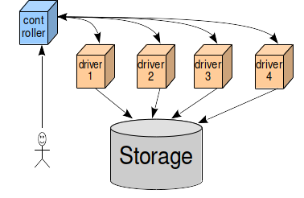

# Introduction

In the new major version of Mongoose the new distributed mode architecture is introduced. Any *distributed load step*
execution may be initiated from any node from the given set. Then the chosen node becomes an temparary *entry node*.
There may be also *additional nodes* involved in the given distributed load step. All necessary input is prepared
(*sliced*) and distributed among the nodes before the actual load step start to get rid of the redundant interaction
via the network during the load step execution. The additional nodes are being polled periodically to synchronize the
load step state. After the load step is done, the summary data may be (optionally) aggregated and persisted on the entry
node.

| v3.x.x | v4.x.x
|----|----
|  | 

* **v3.x.x**
    * The "controller" is used to initiate the run
    * The "controller" is located at separate host usually
    * The "drivers" are "thin": execute the I/O tasks only (in other words, contains storage driver only)
    * The "controller" is "rich"
* **v4.x.x**
    * The *entry node* is used to initiate the run
    * Any node may be used to initiate the run
    * The *additional node* is functionally "rich": it executes the load step "slices" entirely and independently (in
      other words, contains storage driver, load generator, load step service, etc)

## Advantages

1. Higher distributed mode performance due to lack of the single point of contention
2. The opportunity to introduce the modular configuration
3. Joint interface for CLI and GUI

# Design

The distributed mode test involves at least one entry node and some set of the additional nodes. The test may be started
from any node from that set. The node selected to start the test should be temporarily treated as the *entry node*.
The entry node is not excluded from the actual load execution.

## Entry Node

Entry node loads the scenario into the corresponding scripting engine. The scripting engine instantiates the scenario
steps. Each load step consists of its local and remote parts. The local step functionality:

* step slicing
* load the input items and distribute to the nodes
* item output file aggregation (optional)
* I/O traces aggregation (optional)

### Scenario Step Slicing

The configuration parameters which are the subject of slicing in the scenario:

1. `item-input-file`
2. `item-input-path`
3. `item-naming-offset`
4. `item-output-path` (in case of parameterization is used)
5. `storage-auth-file`
6. `storage-net-http-headers-*` (in case of parameterization is used)
7. `storage-net-node-addrs` (if node-to-node mapping is enabled)
8. `load-step-node-addrs` set to empty list value

#### Items Input

The items input is being read locally if configured. The items from the input are distributed to the files located on
the remote side. Then these files are used as items input files by the remote side.

#### Item Naming Scheme

New configuration parameter `item-naming-step` is required to support a load step slicing in case of a non-random item
naming scheme. The default `item-naming-step` parameter value is 1. In the distributed mode the value is equal to the
count of the slave nodes involved in the test.

Example:

* item-naming-length: 2
* item-naming-offset: 0
* item-naming-radix: 10
* item-naming-scheme: asc
* node-addrs: A,B,C,D
* load-step-limit-count: 18

| Node # | Offset | Resulting Item Names |
|--------|--------|----------------------|
| A      | 0      | 00, 04, 08, 12, 16   |
| B      | 1      | 01, 05, 09, 13, 17   |
| C      | 2      | 02, 06, 10, 14       |
| D      | 3      | 03, 07, 11, 15       |

## Remote

### Control

1. Run actually the configured scenario step slice
    1. Local scenario step should remember the environment variables got upon instantiation from the scripting engine
    2. Scenario step slice should be serializable
    3. Items for the input should be transferred and persisted too
2. Determine the specified step state (started, paused, finished)
3. Return the processed items (optional)
4. Return the I/O traces data (optional)

### Monitoring

TODO

# Configuration

* `load-step-node-addrs`

    Comma-separated list of additional node IP addresses/hostnames. The default value is empty list (standalone mode).
    Adding the port numbers is allowed to override the `load-step-distributed-node-port` value. For example
    `nodeA:1100,nodeB:1101,nodeC:1111`

* `load-step-node-port`

    The network port for the interaction between the nodes/peers. 1099 by default.
