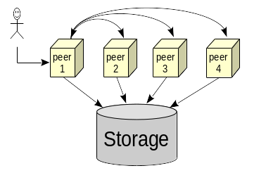

# Introduction

In the new major version of Mongoose the new distributed mode architecture is introduced. Any *distributed load step*
execution may be initiated from any node from the given set. Then the chosen node becomes an temparary *entry node*.
There may be also *additional nodes* involved in the given distributed load step. All necessary input is prepared
(*sliced*) and distributed among the nodes before the actual load step start to get rid of the redundant interaction
via the network during the load step execution. The additional nodes are being polled periodically to synchronize the
load step state. After the load step is done, the summary data may be (optionally) aggregated and persisted on the entry
node.

| v3.x.x | v4.x.x
|--------|-------
|  | 

* **v3.x.x**
    * The "controller" is used to initiate the run
    * The "controller" is located at separate host usually
    * The "drivers" are "thin": execute the load operations and control the concurrency level only
    * The "controller" is "rich"
* **v4.x.x**
    * The *entry node* is used to initiate the run
    * Any node may be used to initiate the run
    * The *additional node* is functionally "rich": it executes the load step "slices" entirely and independently (in
      other words, contains storage driver, load generator, load step service, etc)

## Advantages

1. Higher distributed mode performance due to lack of the single point of contention
2. The opportunity to introduce the modular configuration
3. Joint interface for CLI and GUI

# Design

## High-Level

### Requirements

| #  | Priority | Description
|----|----------|------------
| 1  | 0 | Initiate the run from any node from the deployed node set
| 2  | 0 | Include the node used to initiate the run to the load step execution
| 3  | 0 | Slice a load step input configuration
| 4  | 0 | Slice a load step input items if an items input is configured and transfer these item input slices to all the nodes involved in the particular load step run
| 5  | 0 | Aggregate the metrics during the load step run
| 6  | 0 | Aggregate the item output file on the entry node if configured
| 7  | 0 | Aggregate the load operation traces log file on the entry node if configured
| 8  | 0 | Share the same load step id for all load step slices for a given load step
| 9  | 1 | Be able to slice the storage node addresses set among the Mongoose nodes involved in the particular load step run
| 10 | 1 | The node should also server the incoming requests to initiate the new run

### Limitations

| # | Description
|---|------------
| 1 | Using the additional node running locally will lead to output files content collision. Local additional nodes should run inside the isolated environment (Docker container, for example).
| 2 | Item input slicing may take a long time before the actual load step starts. The progress info is displayed every 10s.
| 3 | Item output file/trace metrics log aggregation may take a long time after the actual load step finishes. The progress info is displayed every 10s.

### Assumptions

| # | Description
|---|------------
| 1 | An user is able to specify the ***additional nodes***. The total count of the nodes involved in a run will be the count of the additional nodes specified **plus 1**. This is due to the local entry node is involved in the test executin also.

## Detailed

Entry node loads the scenario into the corresponding scripting engine. The scripting engine instantiates the scenario
steps. Each load step consists of its local and remote parts (slices).

### Scenario Step Slicing

The configuration parameters which are the subject of slicing in the scenario:

1. `item-input-file`
2. `item-input-path`
3. `item-naming-offset`
4. `item-output-path` (in case of parameterization is used)
5. `storage-auth-file`
6. `storage-net-http-headers-*` (in case of parameterization is used)
7. `storage-net-node-addrs` (if node-to-node mapping is enabled)
8. `load-step-node-addrs` set to empty list value

#### Items Input

The items input is being read locally if configured. The items from the input are distributed to the files located on
the remote side. Then these files are used as items input files by the remote side.

#### Item Naming Scheme

New configuration parameter `item-naming-step` is required to support a load step slicing in case of a non-random item
naming scheme. The default `item-naming-step` parameter value is 1. In the distributed mode the value is equal to the
count of the slave nodes involved in the test.

Example:

* item-naming-length: 2
* item-naming-offset: 0
* item-naming-radix: 10
* item-naming-scheme: asc
* load-step-node-addrs: A,B,C
* load-step-limit-count: 18

| Node    | Offset | Resulting Item Names |
|---------|--------|----------------------|
| <LOCAL> | 0      | 00, 04, 08, 12, 16   |
| A       | 1      | 01, 05, 09, 13, 17   |
| B       | 2      | 02, 06, 10, 14       |
| C       | 3      | 03, 07, 11, 15       |

### Configuration

* `load-step-node-addrs`

    Comma-separated list of additional node IP addresses/hostnames. The default value is empty list (standalone mode).
    Adding the port numbers is allowed to override the `load-step-distributed-node-port` value. For example
    `nodeA:1100,nodeB:1101,nodeC:1111`

* `load-step-node-port`

    The network port for the interaction between the nodes/peers. 1099 by default.

* `run-node`

    The option which tells to run in the node service mode
